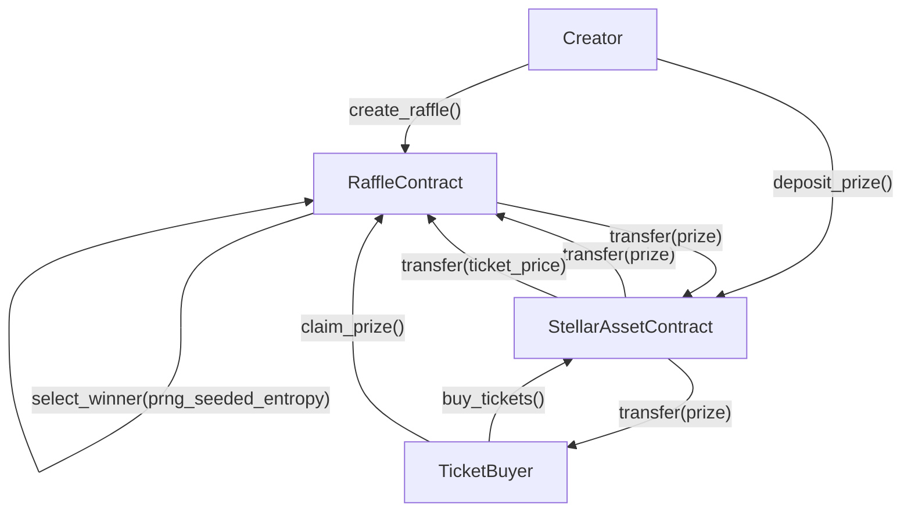

# Tikka - Decentralized Raffle Platform


> Documentation is indexed in [docs/README.md](docs/README.md). The repository
> is currently undergoing a hardening and build-repair pass; feature claims
> should be treated as unverified until the relevant contract compiles.

[](https://codecov.io/gh/OWNER/tikka-contracts)

## 🎯 What is Tikka?

Tikka is a decentralized raffle platform built on Stellar using Soroban smart contracts. Users can create raffles, sell tickets priced in Stellar assets, and distribute prizes securely on-chain.

## 🚀 Key Features

### **🎲 On-Chain Winner Selection**

- Internal draws use Soroban `env.prng()` with a multi-source seed:
    `timestamp + sequence + raffle_id + tickets_sold`
- Deterministic replay for identical raffle and ledger inputs
- Intended for low-stakes raffles; high-stakes draws should use oracle randomness

### **👤 Creator Profiles**

- **Display Names**: Creators can set on-chain display names for brand identity
- **Verified Badges**: Admin-granted verified status for trusted organizers
- **Track Record**: Automatic counting of raffles created per organizer
- **Trust Signals**: Frontends can display creator reputation without off-chain databases

### **💰 Token-Based Tickets and Prizes**

- **Ticket Purchases**: Any Stellar asset contract
- **Prizes**: Same asset used for ticket purchases
- **Flexible Pricing**: Set ticket prices and prize amount per raffle

### **🔒 Escrowed Prizes**

- Prizes are held in the smart contract until finalization
- Winners claim prizes after the raffle ends

### **📊 Basic Raffle Analytics**

- Total tickets sold per raffle
- Winner tracking and claim status

## 🏗️ How Tikka Works

### **1. Raffle Creation**

```text
Creator → Create Raffle → Set Parameters
```

- Raffle creators specify:
  - Description and end time
  - Maximum ticket count
  - Ticket price and payment asset
  - Whether multiple tickets per person are allowed
  - Prize amount (in the same payment asset)

### **2. Prize Escrow**

```text
Creator → Deposit Prize → Contract Escrow
```

- Prizes are transferred to the smart contract
- Contract holds the prize until raffle finalization

### **3. Ticket Sales**

```text
Participants → Buy Tickets → Contract Validation → Ticket Issuance
```

- Users purchase tickets with the raffle asset
- Contract validates payment and issues tickets
- One ticket equals one entry in the raffle

### **4. Winner Selection**

```text
Raffle Ends → Finalize → Select Winner
```

- Winner is selected from sold tickets
- Internal mode uses Soroban PRNG seeded with multiple ledger and raffle fields
- External/oracle mode remains available for stronger trust assumptions

### **5. Prize Distribution**

```text
Winner Selected → Claim Prize
```

- Winners claim their prizes

### **Raffle Flow Diagram**



## 🔧 Technical Architecture

For authoritative architecture, storage, randomness, event, error, testing,
and deployment documentation, see the [documentation index](docs/README.md).

### **Smart Contract Stack**

- **Soroban (Rust)**: Smart contract implementation
- **Stellar**: Network and asset contracts

### **Core Contracts**

#### **`contracts/raffle-factory/src/lib.rs`**

```rust
pub fn init_factory(... ) -> Result<(), ContractError>;
pub fn create_raffle(... ) -> Result<Address, ContractError>;
pub fn get_raffles(... ) -> PageResultRaffles;
```

#### **`contracts/raffle-instance/src/lib.rs`**

```rust
pub fn init(... ) -> Result<(), Error>;
pub fn deposit_prize(... ) -> Result<(), Error>;
pub fn buy_tickets(... ) -> Result<u32, Error>;
pub fn finalize_raffle(... ) -> Result<(), Error>;
pub fn provide_randomness(... ) -> Result<(), Error>;
pub fn claim_prize(... ) -> Result<i128, Error>;
pub fn cancel_raffle(... ) -> Result<(), Error>;
pub fn refund_ticket(... ) -> Result<i128, Error>;
pub fn get_raffle(... ) -> Result<Raffle, Error>;
```

### **Data Structures**

`RaffleConfig` (`contracts/raffle-shared/src/lib.rs`) is the configuration payload supplied when creating a raffle. Values are validated by contract initialization before the raffle becomes active and represent the complete raffle policy surface:

```rust
pub struct RaffleConfig {
    pub description: String,                  // Human-readable raffle description.
    pub end_time: u64,                        // Unix timestamp when ticket sales close (ignored when `no_deadline` is true).
    pub no_deadline: bool,                    // If true, raffle can remain open without a hard end timestamp.
    pub max_tickets: u32,                     // Maximum number of tickets that can ever be sold.
    pub max_tickets_per_tx: u32,              // Maximum tickets a single address may purchase per transaction.
    pub min_tickets: u32,                     // Minimum number of tickets required for a successful draw.
    pub allow_multiple: bool,                 // Whether one address may own multiple tickets.
    pub ticket_price: i128,                   // Price per ticket denominated in the payment token's base units.
    pub payment_token: Address,               // Soroban address for the token used to buy tickets.
    pub prize_amount: i128,                   // Total prize amount denominated in the same payment token.
    pub prizes: Vec<u32>,                     // Prize distribution vector; each value maps to winner allocation units.
    pub randomness_source: RandomnessSource,  // Randomness source strategy selected for the raffle.
    pub oracle_address: Option<Address>,      // Optional oracle contract address for external randomness flows.
    pub protocol_fee_bp: u32,                 // Protocol fee in basis points (100 = 1%), charged at ticket purchase only.
    pub treasury_address: Option<Address>,    // Optional treasury recipient address for protocol fees.
    pub swap_router: Option<Address>,         // Optional router contract used when swap-based flows are enabled.
    pub tikka_token: Option<Address>,         // Optional protocol token used in incentive/swap features.
    pub metadata_hash: BytesN<32>,            // SHA-256 hash of immutable off-chain metadata content.
    pub claim_lockup_seconds: u64,            // Seconds after finalization before winners may claim (0-604800, defaults to 3600).
    pub swap_deadline_seconds: u64,           // Swap deadline window in seconds, added to current timestamp (defaults to 300).
    pub early_bird_ticket_percentage: u32,    // Percentage of max_tickets covered by the early bird discount (0 to disable).
    pub early_bird_discount_bp: u32,          // Early bird discount amount in basis points.
    pub category: Option<String>,             // Optional on-chain category/tag used for frontend filtering.
}
```

**Related types (`contracts/raffle-shared/src/lib.rs`)**

-   `RaffleStatus` — lifecycle state of a raffle instance: `PendingPrize`, `Active`, `Drawing`, `Finalized`, `Cancelled`, `Failed`, `Claimed`.
-   `RandomnessSource` — randomness strategy used for a raffle: `Internal`, `External`, `CommitReveal`.
-   `RandomnessType` — classification of the randomness mechanism requested or received: `Prng`, `Vrf`, `Fallback`.
-   `CancelReason` — canonical reason a raffle entered `Cancelled`: `CreatorCancelled`, `AdminCancelled`, `OracleTimeout`, `MinTicketsNotMet`.
-   `FailureReason` — canonical reason a raffle entered `Failed`: `ZeroTicketsSold`, `MinTicketsNotMet`.
-   `Ticket` — `id`, `owner`, `purchase_time`, `ticket_number`.
-   `FairnessData` — audit data proving how a draw outcome was derived: `seed`, `randomness_source`, `ticket_ids`, `winning_ticket_indices`, `draw_timestamp`, `draw_sequence`.

`Raffle` (`contracts/raffle-instance/src/lib.rs`) is the on-chain record stored for each raffle instance. It mirrors the resolved `RaffleConfig` fields and adds live raffle state:

```rust
pub struct Raffle {
    pub creator: Address,
    pub payment_token: Address,
    pub treasury_address: Option<Address>,
    pub description: String,
    pub end_time: u64,
    pub max_tickets: u32,
    pub min_tickets: u32,
    pub allow_multiple: bool,
    pub ticket_price: i128,
    pub prize_amount: i128,
    pub prizes: Vec<u32>,
    pub tickets_sold: u32,
    pub status: RaffleStatus,
    pub prize_deposited: bool,
    pub winners: Vec<Address>,
    pub claimed_winners: Vec<bool>,
    pub randomness_source: RandomnessSource,
    pub oracle_address: Option<Address>,
    pub protocol_fee_bp: u32,                 // Charged at ticket purchase only; prize-claim fees are not implemented.
    pub treasury_address: Option<Address>,
    pub swap_router: Option<Address>,
    pub tikka_token: Option<Address>,
    pub finalized_at: Option<u64>,
    pub winner_ticket_id: Option<u32>,
    pub claim_lockup_seconds: Option<u64>,
    pub swap_deadline_seconds: Option<u64>,
    // ...all RaffleConfig fields (resolved via `resolve_defaults`), plus:
    pub creator: Address,               // Address that created and configured the raffle.
    pub prize_token: Address,           // Token used for prize deposit and claims; defaults to `payment_token`.
    pub tickets_sold: u32,              // Running count of tickets sold so far.
    pub status: RaffleStatus,           // Current lifecycle state of the raffle.
    pub prize_deposited: bool,          // Whether the creator has deposited the prize into escrow.
    pub winners: Vec<Address>,          // Addresses selected as winners after the draw.
    pub claimed_winners: Vec<bool>,     // Per-winner claim status, indexed alongside `winners`.
    pub finalized_at: Option<u64>,      // Unix timestamp when the raffle was finalized.
    pub ticket_sales_paused: bool,      // Whether ticket sales are currently paused by an admin.
}
```

### **Contract Constraints**

- Up to **100 prize tiers** per raffle (`MAX_PRIZES = 100`), supporting multi-winner raffles
- Up to **100,000 tickets** per raffle (`MAX_TICKETS_LIMIT = 100,000`)
- Minimum ticket price of **10,000 base units** (`MIN_TICKET_PRICE = 10_000`)
- Maximum prize pool of **1e21 base units** (`MAX_PRIZE_AMOUNT = 1_000_000_000_000_000_000_000`)
- Maximum protocol fee of **20%** (`MAX_PROTOCOL_FEE_BP = 2_000` basis points)
- Prize and ticket payments use the same Stellar asset
- Internal PRNG is suitable for low-stakes raffles; for high-stakes raffles, prefer the external oracle/VRF randomness path

## 🔒 Metadata Integrity (metadata_hash)

Every raffle requires a `metadata_hash: BytesN<32>` — a SHA-256 hash of the off-chain metadata JSON stored on IPFS. This hash is committed on-chain at creation and is immutable, so organizers cannot alter the description, image, or rules after tickets are sold.

### Metadata JSON format

```json
{
  "name": "My Raffle",
  "description": "Full rules and description here",
  "image": "ipfs://Qm...",
  "rules": "..."
}
```

### Generating the hash

**Linux / macOS**

```bash
# 1. Create your metadata file
cat > metadata.json << 'EOF'
{"name":"My Raffle","description":"...","image":"ipfs://Qm...","rules":"..."}
EOF

# 2. Hash it (outputs hex)
sha256sum metadata.json
# or on macOS:
shasum -a 256 metadata.json
```

**Node.js**

```js
const crypto = require("crypto");
const fs = require("fs");
const hash = crypto
  .createHash("sha256")
  .update(fs.readFileSync("metadata.json"))
  .digest("hex");
console.log(hash); // 64-char hex string → 32 bytes
```

**Python**

```python
import hashlib, json

meta = {"name": "My Raffle", "description": "...", "image": "ipfs://Qm...", "rules": "..."}
# Use compact, sorted JSON for reproducibility
raw = json.dumps(meta, separators=(',', ':'), sort_keys=True).encode()
print(hashlib.sha256(raw).hexdigest())
```

### Converting hex → `BytesN<32>` for the contract call

```bash
# Stellar CLI example — pass as a hex-encoded bytes argument
stellar contract invoke ... -- \
  --metadata_hash "$(sha256sum metadata.json | cut -d' ' -f1)"
```

> **Important:** Use a canonical JSON serialization (compact, keys sorted) so the hash is reproducible by anyone who downloads the metadata from IPFS.

---

### **Stellar Testnet**

- **Contract Address**: `CCTCPMI66REXIJQPVOPNTNUZBCMSRM7TZLMIPQROZIID44XNP2P2MKFZ`

## 🔄 CI/CD Testnet Smoke Test

A weekly GitHub Actions workflow (`.github/workflows/testnet-smoke.yml`) runs every Monday at 6 AM UTC to deploy and exercise a full raffle lifecycle on Stellar Testnet. It can also be triggered manually via `workflow_dispatch`.

The smoke test:
1.  Deploys the factory contract
2.  Creates a raffle instance
3.  Buys 1 ticket
4.  Finalizes the raffle
5.  Claims the prize
6.  Asserts all steps succeed

### Required Secret

The workflow requires a `TESTNET_SECRET_KEY` repository secret — the Stellar secret key (`S...`) of a funded testnet account used for all on-chain operations.

To set it up:

```bash
# Generate a new keypair
stellar keys generate smoke-test-account

# Fund it via Friendbot
curl "https://friendbot.stellar.org?addr=$(stellar keys address smoke-test-account)"

# Export the secret key
stellar keys show smoke-test-account
```

Then add the `S...` secret as a repository secret named `TESTNET_SECRET_KEY` in the GitHub repo settings under **Settings → Secrets and variables → Actions**.

> **Security:** The `TESTNET_SECRET_KEY` secret should only have testnet funds. Never use a mainnet key for CI/CD.

## 🚀 Getting Started

### **Prerequisites**

- Rust toolchain
- Stellar CLI v23.x, matching this workspace's Soroban SDK 23.x dependency
- Node.js 20.x for the oracle service in `oracle/`

### **Run Tests**

```bash
make test
```

### **Build the Contract**

```bash
make build
```

## 🛠️ Development

The repo provides a top-level `Makefile` for local development. Common targets:

```bash
make build       # Build all contracts
make test        # Run all tests
make lint        # Format + clippy
make fuzz        # Run fuzz targets
make all         # lint + test + build (CI-like)
```

For additional setup details and build prerequisites, see [docs/DEVELOPMENT.md](docs/DEVELOPMENT.md).

## 🤝 Contributing

See `CONTRIBUTING.md` for contribution guidelines and PR expectations.
Please also read our [Code of Conduct](CODE_OF_CONDUCT.md).

## 📚 Documentation

- **Documentation Index**: [`docs/README.md`](docs/README.md) — Complete guide to all documentation files
- **Architecture Diagram**: [`docs/ARCHITECTURE.md`](docs/ARCHITECTURE.md) — Factory → instance → oracle flow and state machine
- **Deployment**: [`docs/DEPLOYMENT.md`](docs/DEPLOYMENT.md) — Deploy contracts to testnet/mainnet using scripts
- **Storage & TTL**: [`docs/STORAGE.md`](docs/STORAGE.md) — Storage layout, tiers, and TTL bump policies
- **Randomness modes**: [`docs/RANDOMNESS.md`](docs/RANDOMNESS.md) — Internal, External, and CommitReveal randomness
- **Commit-Reveal Protocol**: [`docs/COMMIT_REVEAL.md`](docs/COMMIT_REVEAL.md) — Multi-phase commit-reveal randomness details
- **Error Codes**: [`docs/ERRORS.md`](docs/ERRORS.md) — Complete error code reference for frontend integration
- **Events Reference**: [`docs/EVENTS.md`](docs/EVENTS.md) — All events emitted by factory and instance contracts
- **Contributor FAQ**: [`docs/FAQ.md`](docs/FAQ.md) — Troubleshooting common setup and build issues
- **Fee Model**: [`docs/FEE_MODEL.md`](docs/FEE_MODEL.md) — Protocol fee collection and revenue distribution
- **Migration Guide**: [`docs/MIGRATION-426.md`](docs/MIGRATION-426.md) — Storage layout migration for PR #426
- **Stellar Soroban**: https://developers.stellar.org/docs/build/smart-contracts/overview
- **Soroban Examples**: https://github.com/stellar/soroban-examples

## 📄 License

This project is licensed under the MIT License - see the [LICENSE](LICENSE) file for details.

## 🆘 Support

For questions, bug reports, and feature requests, see [`SUPPORT.md`](SUPPORT.md).

- **Questions & How-Tos**: [GitHub Discussions](https://github.com/stellar/tikka-contracts/discussions)
- **Report Bugs**: [GitHub Issues](https://github.com/stellar/tikka-contracts/issues)
- **Request Features**: [GitHub Issues](https://github.com/stellar/tikka-contracts/issues)
- **Documentation**: Check [`docs/README.md`](docs/README.md) and [`docs/FAQ.md`](docs/FAQ.md)

---

**Built with ❤️ on Stellar**
