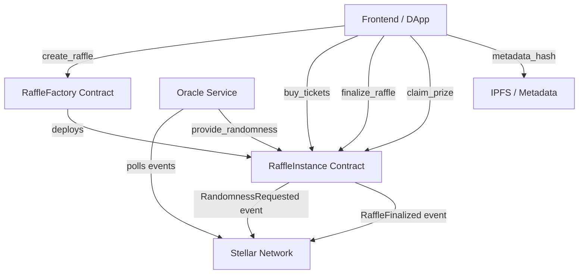
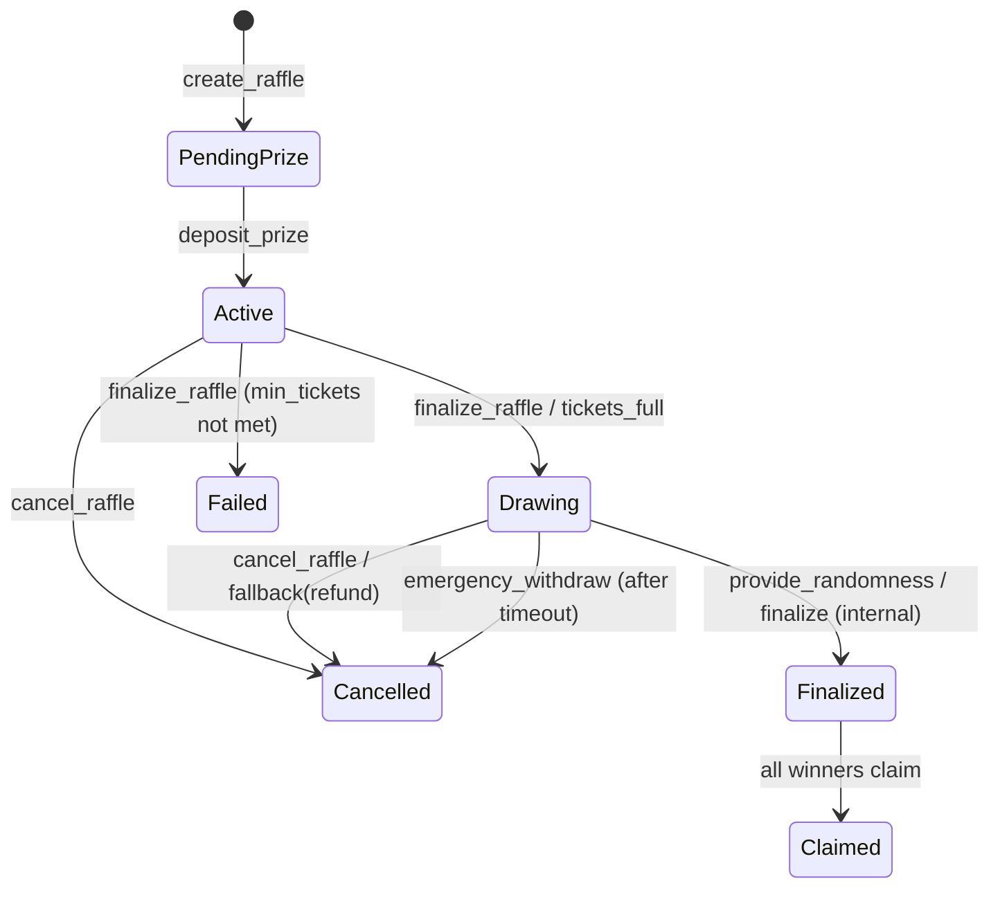

# Tikka Architecture

This document explains how the factory, raffle instances, oracle, and clients interact.

## Factory -> Instance -> Oracle Flow



### Flow explanation

1. A creator calls `create_raffle` on the factory with `RaffleConfig`.
1. The factory deploys a new raffle instance and returns the new instance address.
1. Users buy tickets directly on the raffle instance contract.
1. When finalization starts, the instance emits randomness request events to the network.
1. The oracle service polls those events and calls `provide_randomness` back on the instance.
1. The instance finalizes winners, emits finalization events, and winners claim prizes.

## RaffleStatus State Machine



### State notes

- `PendingPrize`: created but not funded yet.
- `Active`: funded and selling tickets.
- `Drawing`: draw execution in progress.
- `Finalized`: winners are locked and can claim.
- `Claimed`: terminal state when all claims are complete.
- `Cancelled` / `Failed`: terminal non-success states.

### Token egress and escrow solvency

The instance has four intended token-moving paths:

- `claim_prize` pays each unclaimed winner and records protocol fees.
- `sweep_unclaimed` pays unclaimed prizes to the treasury after the claim
    expiry period and marks those prizes claimed.
- `refund_prize` returns the deposited prize after `Cancelled` or `Failed`.
- `refund_ticket` returns each ticket payment after `Cancelled` or `Failed`.
- `withdraw_fees` pays only recorded accumulated fees after finalization.

Administrative escape paths are constrained by the same invariant:

- `emergency_withdraw` is only available for a timed-out `Drawing` raffle.
    Its delay starts at `end_time`, or at the randomness request ledger for a
    no-deadline raffle. It transfers only the deposited prize token and leaves
    all remaining obligations covered.
- `rescue_tokens` can transfer unrelated-token surplus, but for either
    configured raffle token it must leave unpaid ticket refunds, accumulated
    fees, and outstanding prize claims fully covered.
- `sweep_dust` is available only after settlement and transfers payment-token
    surplus above all remaining entitlements; accumulated fees are preserved.

Escrow solvency is a protocol guarantee. After every successful state-changing
entrypoint, configured-token balances must cover all stored entitlements:

```text
balance(prize_token)   >= unclaimed_prize_total
balance(payment_token) >= unrefunded_ticket_total + accumulated_fees_owed
```

When `payment_token == prize_token`, these are enforced as one combined
inequality over the shared token balance. `unclaimed_prize_total`,
`unrefunded_ticket_total`, and `accumulated_fees_owed` are derived from
contract storage, not off-chain indexer state or test bookkeeping.

No token-moving path may reduce a token balance below its outstanding
entitlement. `emergency_withdraw` cannot operate on `Finalized`, because
unclaimed winners remain entitled to their prizes.

### Entrypoint Lifecycle Transition Matrix

The following table summarizes the behavior of mutating contract entrypoints across all 7 `RaffleStatus` states (#623):

| Mutating Entrypoint | PendingPrize | Active | Drawing | Finalized | Cancelled | Failed | Claimed |
|---|---|---|---|---|---|---|---|
| `deposit_prize` | **Allowed** (-> Active) | Rejected (`PrizeAlreadyDeposited`) | Rejected (`PrizeAlreadyDeposited`) | Rejected (`PrizeAlreadyDeposited`) | Rejected (`PrizeAlreadyDeposited`) | Rejected (`PrizeAlreadyDeposited`) | Rejected (`PrizeAlreadyDeposited`) |
| `buy_tickets` | Rejected (`RaffleInactive`) | **Allowed** (-> Active / Drawing) | Rejected (`DrawingAlreadyInProgress` / `RaffleInactive`) | Rejected (`RaffleInactive`) | Rejected (`RaffleInactive`) | Rejected (`RaffleInactive`) | Rejected (`RaffleInactive`) |
| `finalize_raffle` | Rejected (`InvalidStateTransition`) | **Allowed** (if ended/full) | **Allowed** (if Drawing) | Rejected (`InvalidStatus`) | Rejected (`InvalidStatus`) | Rejected (`InvalidStatus`) | Rejected (`InvalidStatus`) |
| `provide_randomness` | Rejected (`InvalidStatus`) | Rejected (`InvalidStatus`) | **Allowed** (-> Finalized) | Rejected (`InvalidStatus`) | Rejected (`InvalidStatus`) | Rejected (`InvalidStatus`) | Rejected (`InvalidStatus`) |
| `claim_prize` | Rejected (`InvalidStatus`) | Rejected (`InvalidStatus`) | Rejected (`InvalidStatus`) | **Allowed** (-> Finalized / Claimed) | Rejected (`InvalidStatus`) | Rejected (`InvalidStatus`) | Rejected (`InvalidStatus`) |
| `cancel_raffle` | **Allowed** (-> Cancelled) | **Allowed** (-> Cancelled) | **Allowed** (-> Cancelled) | Rejected (`InvalidStatus`) | Rejected (`InvalidStatus`) | **Allowed** (-> Cancelled) | Rejected (`InvalidStatus`) |
| `refund_ticket` | Rejected (`InvalidStatus`) | Rejected (`InvalidStatus`) | Rejected (`InvalidStatus`) | Rejected (`InvalidStatus`) | **Allowed** | **Allowed** | Rejected (`InvalidStatus`) |

